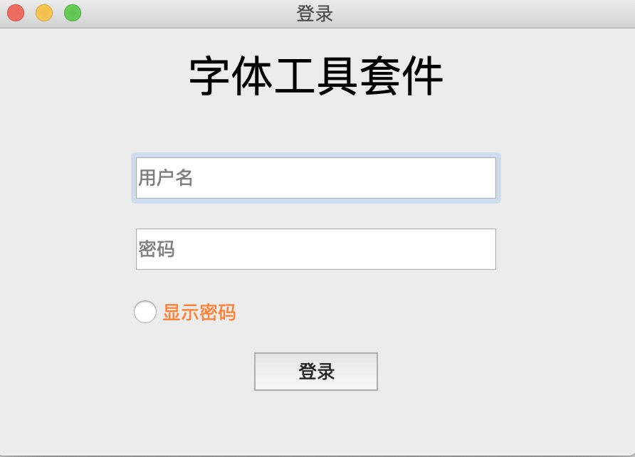
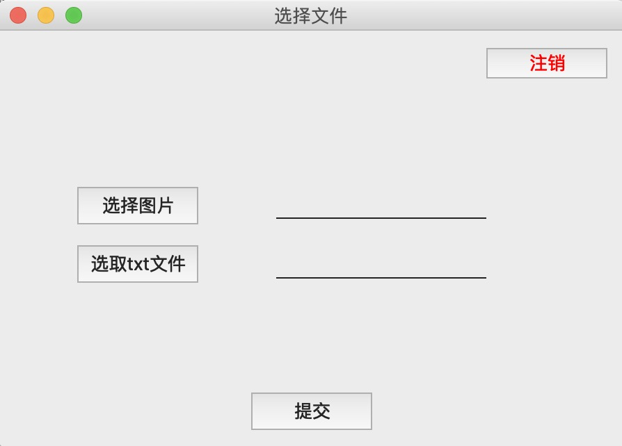
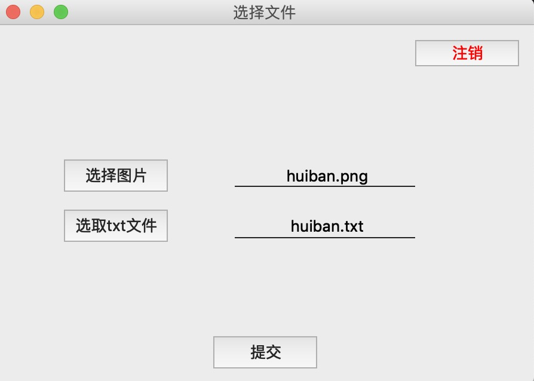
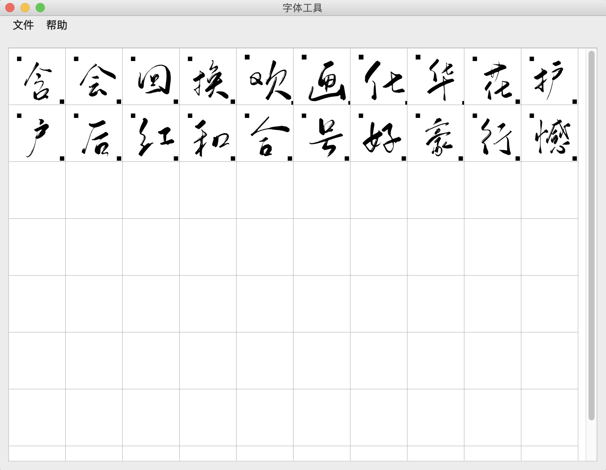

# PyQT 字体处理

基于PyQT5开发的一款，字体处理客户端，通过Requests与后端交互.

## 一.功能描述
- 客户端用户登录，需要后端token认证，本地做了数据库缓存, access_token有效期间可免密登录, 
refresh_token 有效期间可自动刷新access_token，否则需要重新登录.
- 上传字体文件：字体文本文件(.txt格式)、字体图片文件(.png), 两文件需同名, 上传至后端进行字体处理.
- 上传成功后等待后端处理并返回本地，返回成功后可本地预览, 可保存为.ttf字体文件.
目前有一个测试账户开放 admin/123
详细的代码功能见[代码文档][1]
## 二.效果预览
1.用户登录

2.字体文件上传

3.字体预览

[1]: 功能描述.md 
